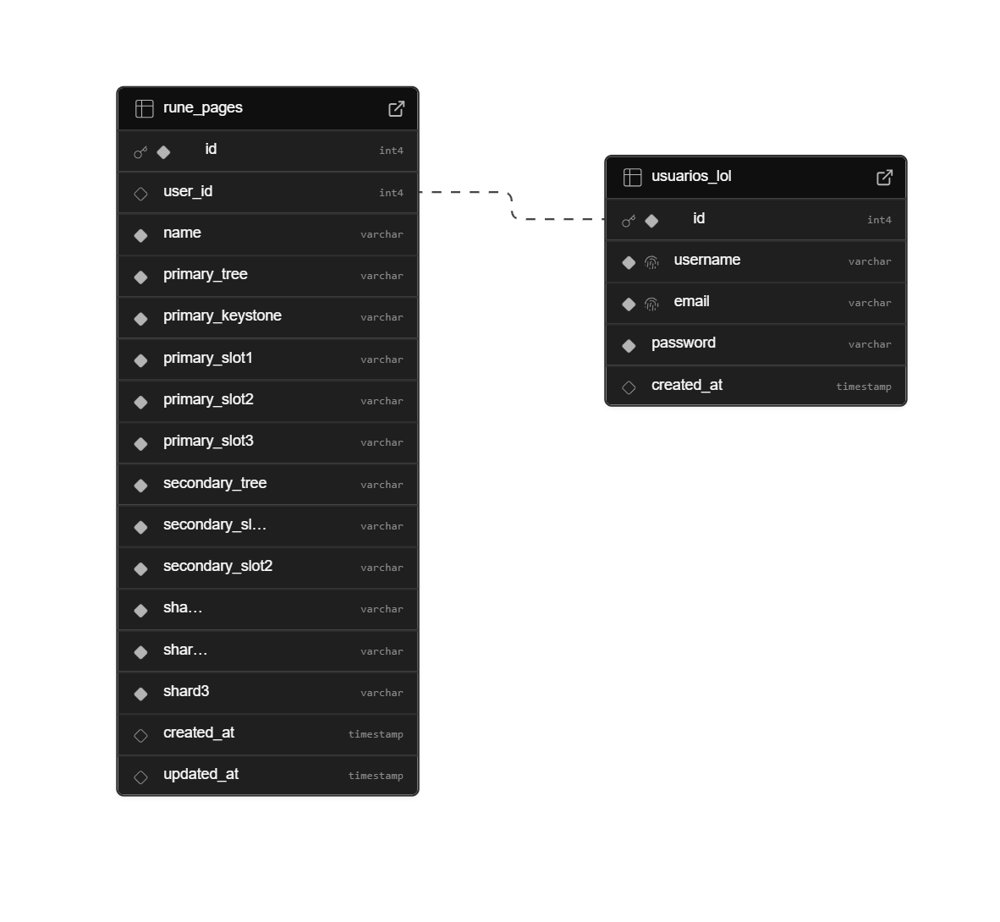

# Web Application Document - Projeto Individual - Módulo 2 - Inteli

## League of Legends Guide

#### Rafael Santana Rodrigues

## Sumário

1. [Introdução](#c1)  
2. [Visão Geral da Aplicação Web](#c2)  
3. [Projeto Técnico da Aplicação Web](#c3)  
4. [Desenvolvimento da Aplicação Web](#c4)  
5. [Referências](#c5)  

<br>

## <a name="c1"></a>1. Introdução (Semana 01)

O **League of Legends Guide** é uma aplicação web educativa desenvolvida para ajudar novos jogadores a compreender os fundamentos do jogo League of Legends. O sistema oferece guias interativos sobre runas, feitiços, classes de campeões, lanes do mapa e mecânicas básicas.

A aplicação possui funcionalidades de autenticação que permitem aos usuários criar e salvar páginas de runas personalizadas, além de acessar conteúdo educativo estruturado sobre diferentes aspectos do jogo.

**Principais Funcionalidades:**
- Sistema de autenticação (login/registro)
- Construtor interativo de páginas de runas
- Guias educativos sobre mecânicas do jogo
- Interface responsiva e intuitiva
- Armazenamento de configurações personalizadas

---

## <a name="c2"></a>2. Visão Geral da Aplicação Web

### 2.1. Personas (Semana 01)

**Persona Principal: João, o Novo Invocador**
- **Idade:** 16-25 anos
- **Perfil:** Estudante/jovem profissional interessado em jogos competitivos
- **Experiência:** Iniciante em League of Legends
- **Objetivos:** Aprender fundamentos do jogo, criar builds de runas eficazes
- **Dores:** Informações espalhadas, interfaces complexas, falta de orientação estruturada

### 2.2. User Stories (Semana 01)

**US01 - Aprender sobre Runas**
Como um novo jogador, eu quero entender o sistema de runas para melhorar meu desempenho no jogo.

**US02 - Criar Páginas de Runas**
Como usuário autenticado, eu quero criar e salvar páginas de runas personalizadas para diferentes campeões.

**US03 - Consultar Guias**
Como iniciante, eu quero acessar guias sobre feitiços, classes e mecânicas para aprender progressivamente.

**US04 - Gerenciar Configurações**
Como usuário registrado, eu quero visualizar e gerenciar minhas páginas de runas salvas.

---

## <a name="c3"></a>3. Projeto da Aplicação Web

### 3.1. Modelagem do banco de dados (Semana 3)

#### Modelo Relacional do Banco de dados 



<hr>

#### Modelo Físico do Banco de Dados

```sql
-- Tabela de usuários para autenticação
CREATE TABLE usuarios_lol (
    id SERIAL PRIMARY KEY,
    username VARCHAR(50) NOT NULL UNIQUE,
    email VARCHAR(100) NOT NULL UNIQUE,
    password VARCHAR(255) NOT NULL,
    created_at TIMESTAMP DEFAULT CURRENT_TIMESTAMP
);

-- Tabela de páginas de runas salvas
CREATE TABLE rune_pages (
    id SERIAL PRIMARY KEY,
    user_id INTEGER REFERENCES usuarios_lol(id) ON DELETE CASCADE,
    name VARCHAR(50) NOT NULL,
    primary_tree VARCHAR(20) NOT NULL,
    primary_keystone VARCHAR(50) NOT NULL,
    primary_slot1 VARCHAR(50) NOT NULL,
    primary_slot2 VARCHAR(50) NOT NULL,
    primary_slot3 VARCHAR(50) NOT NULL,
    secondary_tree VARCHAR(20) NOT NULL,
    secondary_slot1 VARCHAR(50) NOT NULL,
    secondary_slot2 VARCHAR(50) NOT NULL,
    shard1 VARCHAR(20) NOT NULL,
    shard2 VARCHAR(20) NOT NULL,
    shard3 VARCHAR(20) NOT NULL,
    created_at TIMESTAMP DEFAULT CURRENT_TIMESTAMP,
    updated_at TIMESTAMP DEFAULT CURRENT_TIMESTAMP
);
```

### 3.1.1 BD e Models (Semana 5)

**Models Implementados:**

1. **User.js**
   - `findByUsername(username)` - Busca usuário por nome
   - `findByEmail(email)` - Busca usuário por email
   - `create(username, email, password)` - Cria novo usuário
   - `verifyPassword(user, password)` - Verifica senha com bcrypt

2. **RunePage.js**
   - `findAllByUser(userId)` - Lista páginas de runas do usuário
   - `create(runePage)` - Cria nova página de runas
   - `delete(id, userId)` - Remove página de runas

### 3.2. Arquitetura (Semana 5)


A aplicação segue o padrão **MVC (Model-View-Controller)** com Express.js:

**Fluxo de Dados:**
1. **User Request** → Routes (`/routes/index.js`)
2. **Routes** → Controller (lógica de negócios)
3. **Controller** → Model (operações de dados)
4. **Model** → Database (PostgreSQL/Supabase)
5. **Database** → Model → Controller → View (EJS)
6. **View** → User Response (HTML renderizado)

**Componentes Principais:**

- **Controllers:**
  - `AuthController` - Autenticação e registro
  - `RunesController` - Sistema de runas e construtor
  - `HomeController` - Página inicial
  - `ChampionsController`, `SpellsController`, etc.

- **Views (EJS):**
  - `pages/` - Páginas principais
  - `auth/` - Login e registro
  - `partials/` - Componentes reutilizáveis

- **Models:**
  - Abstração da camada de dados
  - Validações e operações CRUD
  - Comunicação com PostgreSQL

- **Static Assets:**
  - `/public/stylesheet/` - CSS responsivo
  - `/public/scripts/` - JavaScript interativo
  - `/public/assets/` - Imagens e recursos

### 3.3. Wireframes (Semana 03)

Os wireframes foram desenvolvidos priorizando:
- **Navegação intuitiva** entre seções
- **Interface responsiva** para diferentes dispositivos
- **Feedback visual** para interações do usuário
- **Hierarquia clara** de informações

### 3.4. Guia de estilos (Semana 05)

**Paleta de Cores:**
- Primária: `#0F1B3C` (Azul escuro - background)
- Secundária: `#C8A964` (Dourado - acentos)
- Texto: `#CDBE91` (Bege claro)
- Cards: `#1e2d50` (Azul médio)

**Tipografia:**
- Font-family: Arial, sans-serif
- Hierarquia clara com tamanhos de 0.8rem a 3rem

**Componentes:**
- Cards com hover effects e transformações suaves
- Botões com gradientes e estados visuais
- Formulários com validação em tempo real

### 3.5. Protótipo de alta fidelidade (Semana 05)

O protótipo implementa:
- **Design system** consistente inspirado no universo de LoL
- **Animações** e micro-interações
- **Responsividade** completa
- **Acessibilidade** com contrast ratio adequado

### 3.6. WebAPI e endpoints (Semana 05)

**Rotas Principais:**

| Método | Endpoint | Descrição |
|--------|----------|-----------|
| GET | `/` | Página inicial |
| GET | `/runes` | Sistema de runas |
| GET | `/runes/builder` | Construtor de runas (auth) |
| GET | `/runes/my-runes` | Páginas salvas (auth) |
| POST | `/runes/save` | Salvar página de runas |
| DELETE | `/runes/:id` | Deletar página de runas |
| GET | `/login` | Formulário de login |
| POST | `/login` | Processar login |
| GET | `/register` | Formulário de registro |
| POST | `/register` | Processar registro |
| GET | `/logout` | Logout |

**Middleware:**
- `checkAuth` - Verificação de autenticação
- `express.session` - Gerenciamento de sessões
- `express.static` - Arquivos estáticos

### 3.7 Interface e Navegação (Semana 07)

<!-- **Frontend Desenvolvido:**

1. **Sistema de Navegação**
   - Menu responsivo com estados ativos
   - Breadcrumbs contextuais
   - Navegação por teclado (Alt + setas)

2. **Páginas Educativas**
   - Conteúdo interativo com JavaScript
   - Cards expansíveis e tooltips
   - Animações CSS suaves

3. **Sistema de Runas**
   - Construtor visual interativo
   - Preview em tempo real
   - Validação de seleções

4. **Autenticação**
   - Formulários com validação
   - Feedback visual de estados
   - Proteção de rotas sensíveis -->

---

## <a name="c4"></a>4. Desenvolvimento da Aplicação Web (Semana 8)

### 4.1 Demonstração do Sistema Web (Semana 8)

<!-- **Funcionalidades Implementadas:**

✅ **Sistema de Autenticação**
- Registro e login com validação
- Hash de senhas com bcrypt
- Sessões persistentes
- Proteção de rotas

✅ **Construtor de Páginas de Runas**
- Interface visual interativa
- Seleção de árvores primárias e secundárias
- Validação de regras do jogo
- Preview em tempo real

✅ **Gerenciamento de Runas**
- Listagem de páginas salvas
- Visualização detalhada
- Exclusão com confirmação
- Timestamps formatados

✅ **Conteúdo Educativo**
- 7 seções temáticas
- Conteúdo interativo com JavaScript
- Animações e efeitos visuais
- Design responsivo

✅ **Banco de Dados**
- PostgreSQL hospedado no Supabase
- Migrations e scripts de setup
- Operações CRUD completas -->

### 4.2 Conclusões e Trabalhos Futuros (Semana 8)

<!-- **Pontos Fortes:**
- ✅ Arquitetura MVC bem estruturada
- ✅ Interface intuitiva e responsiva
- ✅ Sistema de autenticação robusto
- ✅ Validações tanto frontend quanto backend
- ✅ Código bem documentado e organizado

**Pontos a Melhorar:**
- 🔄 Implementar testes unitários (Jest configurado)
- 🔄 Adicionar cache de sessões (Redis)
- 🔄 Implementar rate limiting
- 🔄 Melhorar SEO e meta tags
- 🔄 Adicionar logs estruturados

**Ideias para Melhorias Futuras:**
- 🚀 Sistema de favoritos para builds
- 🚀 Compartilhamento de páginas de runas
- 🚀 Integração com API oficial da Riot
- 🚀 Sistema de comentários e avaliações
- 🚀 Dashboard administrativo
- 🚀 Notificações push para atualizações
- 🚀 Sistema de conquistas/badges
- 🚀 Modo offline com service workers -->

---

## <a name="c5"></a>5. Referências

1. **Riot Games Developer Portal** - https://developer.riotgames.com/
2. **League of Legends Official Site** - https://www.leagueoflegends.com/
3. **Express.js Documentation** - https://expressjs.com/
4. **EJS Templating** - https://ejs.co/
5. **PostgreSQL Documentation** - https://www.postgresql.org/docs/
6. **Supabase Documentation** - https://supabase.com/docs
7. **MDN Web Docs** - https://developer.mozilla.org/
8. **Node.js Best Practices** - https://github.com/goldbergyoni/nodebestpractices

---